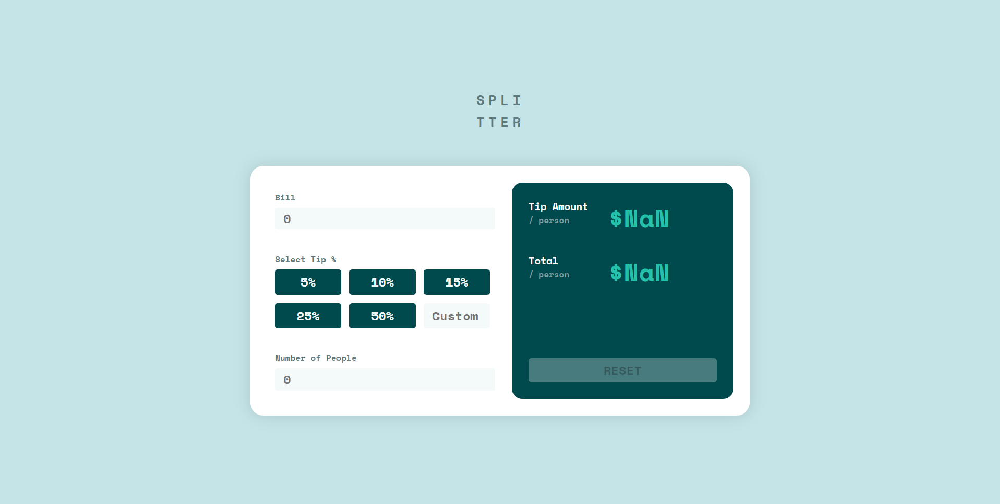

# Frontend Mentor - Tip calculator app solution

This is a solution to the [Tip calculator app challenge on Frontend Mentor](https://www.frontendmentor.io/challenges/tip-calculator-app-ugJNGbJUX). Frontend Mentor challenges help you improve your coding skills by building realistic projects.

## Table of contents

- [Frontend Mentor - Tip calculator app solution](#frontend-mentor---tip-calculator-app-solution)
  - [Table of contents](#table-of-contents)
  - [Overview](#overview)
    - [The challenge](#the-challenge)
    - [Screenshot](#screenshot)
    - [Links](#links)
  - [My process](#my-process)
    - [Built with](#built-with)
    - [What I learned](#what-i-learned)
    - [Continued development](#continued-development)
  - [Author](#author)

## Overview

### The challenge

Users should be able to:

- View the optimal layout for the app depending on their device's screen size
- See hover states for all interactive elements on the page
- Calculate the correct tip and total cost of the bill per person

### Screenshot



### Links

- Solution URL: [https://www.frontendmentor.io/solutions/tip-calculator-made-entirely-with-vuejs-q6peEdfB2-](https://www.frontendmentor.io/solutions/tip-calculator-made-entirely-with-vuejs-q6peEdfB2-)
- Live Site URL: [https://admirable-begonia-dfe568.netlify.app/](https://admirable-begonia-dfe568.netlify.app/)

## My process

### Built with

- Semantic HTML5 markup
- CSS
- Flexbox
- [Vue.js](https://reactjs.org/) - Vue Framework

### What I learned

- learnt how to reset the `data(){}` property in vue.
  ```js
  export default {
    data() {
      return this.initialState();
    },
    methods: {
      initialState() {
        return {
          isChecked: false,
          isDisabled: true,
          tip: null,
          bill: null,
          noOfPeople: null,
        };
      },
      reset() {
        Object.assign(this.$data, this.initialState());
      },
    },
  };
  ```

````
- learnt about the `:maxlength` property in Vue.js
```html
<input type="text" placeholder="0" v-model="bill" :maxlength="3"/>
````

### Continued development

- I need to add responsiveness for phone/tablet devices.
- I need to add icons before the inputs and align input text to the right side.
- I need to set the totals to $0.00 by default

## Author

- Website - [Joshua Steed](https://www.joshuasteed.com)
- Frontend Mentor - [@0xjoshva](https://www.frontendmentor.io/profile/0xjoshva)
